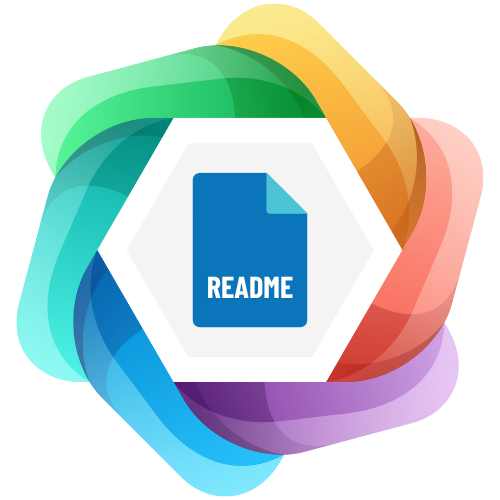

  [](README-pt.md)

<br/><br/>
<p align="center">
    
</p>
<br/>
<p align="center">
    
    
</p>
<br/><br/>

# Readme Templates

Templates for README files to structure project information in repositories.

## 📚 Index

- [About](#about)
- [Available Templates](#🎯-available-templates)
- [How to Use](#👾-how-to-use)
- [Contributions](#🧑‍🤝‍🧑-contributions)
- [Developer](#☕️-developed-by)
- [License](#📝-license)

## About

Welcome to your new best friend for README files! This repository aims to gather a collection of templates to help developers present their projects in an organized and professional manner.

## 🎯 Available Templates

### 🎨 Front-end Projects
Perfect for web applications, SPAs, and UI projects:
- **Simple Page Template** - Basic template for front-end projects
- Technologies covered: React, HTML5, CSS3, JavaScript, TailwindCSS

### ⚙️ Back-end Projects
Ideal for APIs, servers, and backend services:
- **Simple Page Template** - Basic template for back-end projects
- Technologies covered: Node.js, TypeScript, Express.js, PostgreSQL, Docker

### 📁 Template Structure
```
├── front-end/
│   ├── simple-page-en.md
│   └── simple-page-pt-br.md
├── back-end/
│   ├── simple-page-en.md
│   └── simple-page-pt-br.md
└── images/
    ├── logo.png
    ├── readme-templates-logo.png
    └── screenshot.png
```

## 👾 How to Use

1. Navigate to the desired folder (`front-end` or `back-end`).
2. Copy the template you like best.
3. Customize it as needed.
4. Save the file as `README.md` in the root directory of your project.

### Quick Start

**For Front-end Projects:**
```bash
# Copy English template
curl -o README.md https://raw.githubusercontent.com/ArielSpencer/readme-templates/main/front-end/simple-page-en.md

# Copy Portuguese template
curl -o README.md https://raw.githubusercontent.com/ArielSpencer/readme-templates/main/front-end/simple-page-pt-br.md
```

**For Back-end Projects:**
```bash
# Copy English template
curl -o README.md https://raw.githubusercontent.com/ArielSpencer/readme-templates/main/back-end/simple-page-en.md

# Copy Portuguese template
curl -o README.md https://raw.githubusercontent.com/ArielSpencer/readme-templates/main/back-end/simple-page-pt-br.md
```

## 🧑‍🤝‍🧑 Contributions

Guidelines on how to contribute to the project with forks, pull requests, etc.

### Steps to Contribute:

1. Clone the repository:

    ```bash
    git clone https://github.com/ArielSpencer/readme-templates.git
    ```

2. Create a new branch:

    ```bash
    git checkout -b feature/NAME
    ```

3. Follow the commit standards of [Conventional Commits](https://www.conventionalcommits.org/en/v1.0.0/).

    ```bash
    git commit -m "docs(README): update installation instructions"
    ```

4. Open a Pull Request explaining the problem solved or the feature added. If there are visual changes, attach a screenshot and wait for review!

    [More details on how to create a pull request](https://docs.github.com/en/pull-requests/collaborating-with-pull-requests/proposing-changes-to-your-work-with-pull-requests/creating-a-pull-request)

## ☕️ Developed by

<div align="center">
    <div style="display: inline-block; margin: 0 30px;">
        <a href="https://github.com/ArielSpencer">
            
        </a>
        <p>Ariel Spencer</p>
        <a href="https://arielspencer.com.br">
            
        </a>
    </div>
</div>

## 📝 License

This project is licensed under the [MIT License](https://opensource.org/licenses/MIT).