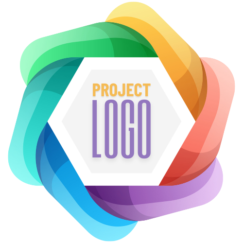
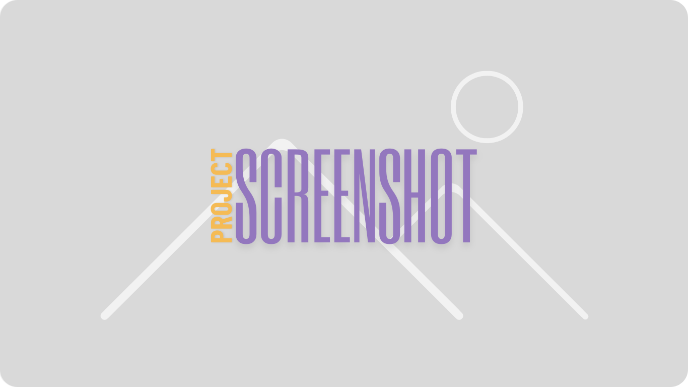

  [](simple-page-pt-br.md)

<br/><br/>
<p align="center">
    
</p>
<br/>
<p align="center">
    
    
    
    
    
</p>
<br/><br/>

# Project Name

**Brief description**: Summary about the project (what it does and what problem it solves).

## 🎨 Layout

<p align="center">
    
    
</p>

## 📚 Table of Contents

- [Description](#📝-description)
- [Technologies](#👾-technologies)
- [Installation and Usage](#🚀-installation-and-usage)
- [Features](#✨-features)
- [Documentation](#📚-documentation)
    - [CSS Variables](#css-variables)
    - [CSS Classes](#css-classes)
- [Contributions](#🧑‍🤝‍🧑-contributions)
- [Team](#team)
- [License](#📝-license)

## ✏️ Description

A more detailed explanation of the project and its purpose.

## 👾 Technologies

A list of technologies and tools used to develop the project.  
Example:

- HTML5
- CSS3
- JavaScript (ES6+)
- React
- TailwindCSS

## 🤖 Installation and Usage

### Prerequisites

List of dependencies and tools needed to run the project, such as Node.js, package managers (npm/yarn), etc.  
Example:
- [Node.js](https://nodejs.org/en/docs/) (version: 18.17.1)

### Installation

1. Clone the repository:
    ```bash
    git clone https://github.com/ArielSpencer/readme-templates.git
    ```

2. Navigate to the project directory:
    ```bash
    cd readme-templates
    ```

3. Open the project in your code editor (optional):
    ```bash
    code .
    ```

4. Install the necessary dependencies:

    If using **npm**:
    ```bash
    npm install
    ```

    If using **yarn**:
    ```bash
    yarn install
    ```

5. Start the application in development mode:
    ```bash
    npm run dev
    ```

### Available Scripts

Details about useful scripts, such as:

- **`npm start`**: Starts the application in development mode. Access [http://localhost:3000](http://localhost:3000) to view it in the browser.
- **`npm run build`**: Builds a production-ready version of the app, storing files in the `build` folder.
- **`npm test`**: Runs tests defined in the app.

## ✨ Features

- Main features of the application.
- Example: Responsiveness, form interactions, etc.

## 📖 Documentation

<details>
<summary>CSS Variables:</summary>

| Variable           | Value                 | Description                                                       |
|--------------------|-----------------------|-------------------------------------------------------------------|
| **--primary-color** | `#3498db`            | The primary color of the application, used for buttons and links. |
| **--secondary-color** | `#2ecc71`          | The secondary color, often used for highlights.                   |
| **--bg-color**      | `#ffffff`            | The background color of the application, typically used for the body. |
| **--text-color**    | `#333333`            | The default text color, used for all application text.            |
| **--border-radius**  | `4px`                | The border radius, applied to buttons and boxes for a rounded effect. |

<hr>
</details>

<br/>

<details>
<summary>CSS Classes:</summary>

| Class             | Value                  | Description                                                                  |
|------------------|------------------------|------------------------------------------------------------------------------|
| **container**     | `class="container"`    | Defines a container with max-width and automatic margins.                    |
| **row**           | `class="row"`          | Creates a flexible row for organizing columns.                               |
| **col**           | `class="col"`          | Defines a column that takes up available space within the row.               |
| **text-center**   | `class="text-center"`  | Centers text.                                                                |
| **btn**           | `class="btn"`          | Styles a button with a default appearance.                                   |

<hr>
</details>


## 🧑‍🤝‍🧑 Contributions

Guidelines on how to contribute to the project with forks, pull requests, etc.

### Contribution Steps:

1. Clone the repository:

    ```bash
    git clone https://github.com/ArielSpencer/readme-templates.git
    ```

2. Create a new branch:

    ```bash
    git checkout -b feature/NAME
    ```

3. Follow the [Conventional Commits](https://www.conventionalcommits.org/en/v1.0.0/) commit standards:

    ```bash
    git commit -m "docs(README): update installation instructions"
    ```

4. Open a Pull Request explaining the issue resolved or the feature added. If there are visual modifications, attach a screenshot and await review!

    [More details on how to create a pull request](https://docs.github.com/en/pull-requests/collaborating-with-pull-requests/proposing-changes-to-your-work-with-pull-requests/creating-a-pull-request)

## ☕️ Developed by

<div align="center">
    <div style="display: inline-block; margin: 0 30px;">
        <a href="https://github.com/ArielSpencer">
            
        </a>
        <p>Ariel Spencer</p>
        <a href="https://arielspencer.com.br">
            
        </a>
    </div>
</div>

## 📝 License

This project is licensed under the [MIT License](https://opensource.org/licenses/MIT).
